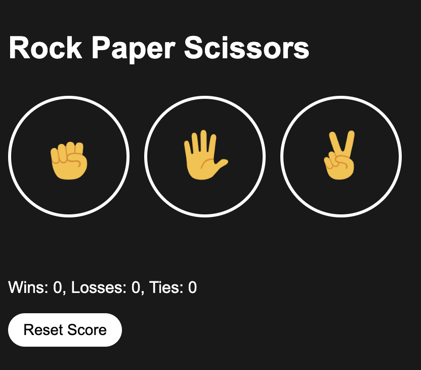
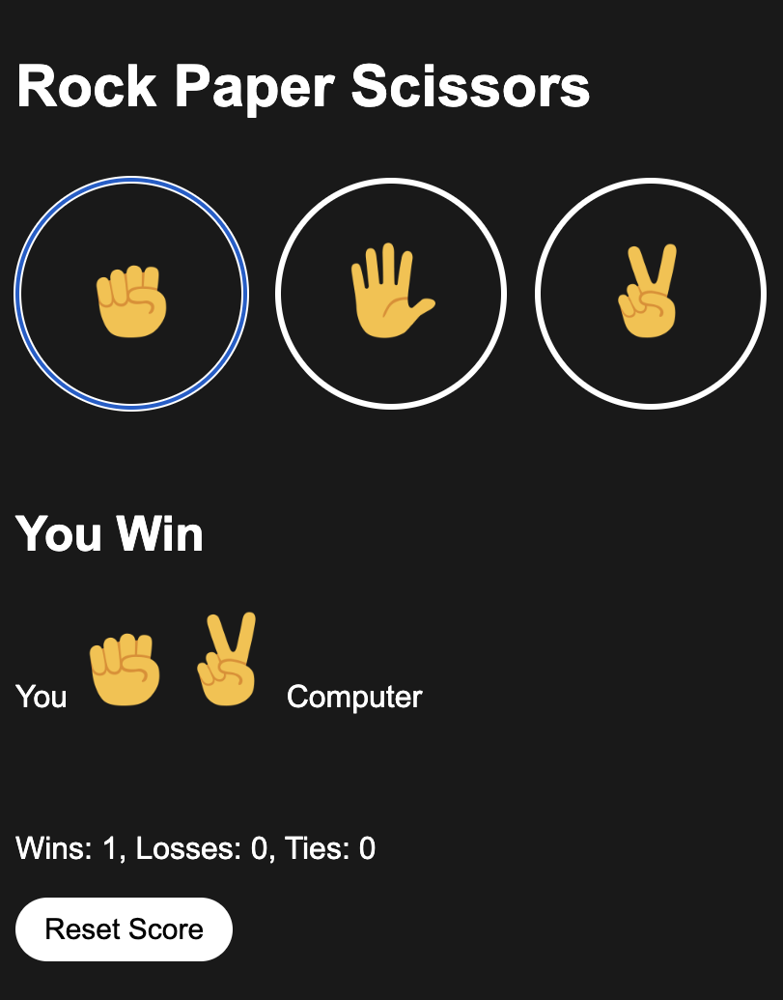
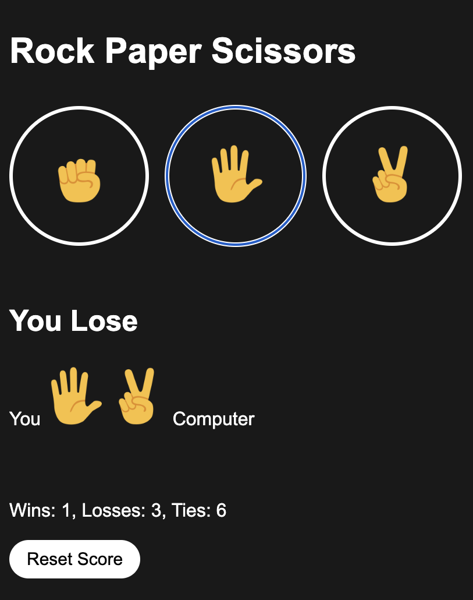

<h1>Rock Paper Scissors</h1>

  A simple, interactive Rock Paper Scissors game built using HTML, CSS, and JavaScript. The game allows players to compete against the computer, and the score is tracked across games until reset.

<h2>Demo</h2>
<ul>
  <li><i>Initial state of the game.</i></li>
  <li><i>Winning scenario.</i></li>
  <li><i>Losing scenario.</i></li>
</ul>

<h2>Features</h2>
<ul>
  <li>Player can select between Rock, Paper, or Scissors by clicking on the respective icons.</li>
  <li>Computer randomly picks its move.</li>
  <li>The result of each round (win, lose, or tie) is displayed along with the moves made by both the player and the computer.</li>
  <li>Scores are tracked and stored in the browser’s **localStorage**, allowing the score to persist between sessions.</li>
  <li>A reset button is provided to clear the scores.</li>
</ul>

<h2>How to Play</h2>
<ol>
  <li>Click on any of the three buttons to choose your move:</li>
  <ul>
    <li>✊ for Rock</li>
    <li>🖐 for Paper</li>
    <li>✌️ for Scissors</li>
  </ul>
  <li>The computer will randomly choose its move.</li>
  <li>The game will display the result, showing whether you win, lose, or tie, as well as the updated score.</li>
</ol>

<h2>Installation</h2>

To get started with the project, follow these steps:

<ol>
  <li>Clone the repository:</li>
  
git clone https://github.com/your-username/rock-paper-scissors.git

  <li>Navigate to the project directory:</li>
  
cd rock-paper-scissors

  <li>Open the rock-paper-scissors.html file in your browser to start the game.</li>
</ol>

<h2>File Structure</h2>
<ul>
  <li>rock-paper-scissors.html: The HTML structure for the game interface.</li>
  <li>rock-paper-scissors.css: The CSS file to style the game interface.</li>
  <li>rock-paper-scissors.js: The JavaScript file handling the game logic and score tracking.</li>
</ul>

<h2>Future Enhancements</h2>

Can add an Autoplay Button to let computer play automatically.

<h2>Screenshots</h2>

